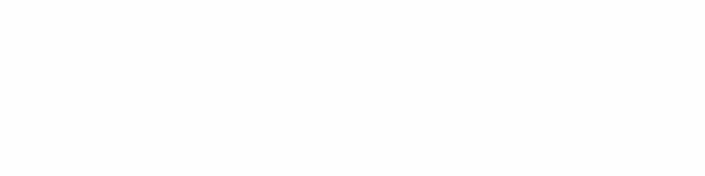

  

    <a href="/README.md">Bhs Inggris</a> •
    <a href="/READMEJP.md">Bhs Jepang</a> •
    <a href="/READMECN.md">Bhs Tionghoa</a>
  

  
  <h1>Hi, saya "Shiazza" atau Anda bisa memanggil saya "Qs" 👋</h1>

<h2>📖 Tentang Saya</h2>

  Seorang siswa yang antusias dengan pemrograman dan selalu belajar keterampilan baru.  
  Percaya pada kerja keras dan tekad. Selalu terbuka untuk kolaborasi dan menjelajahi peluang baru di dunia teknologi.

<h2>🌐 Media Sosial & Dukungan</h2>

🔠Temukan saya di:

  

    
    
    
    
  

  

    
💸 Dukung saya di:

    
    
  

<h2>💻 Keterampilan Pemrograman</h2>
 
<ul align="left">
  <li><strong>Frontend:</strong>   </li>
  <li><strong>Backend:</strong> </li>
  <li><strong>Framework:</strong>  </li>
  <li><strong>Pengembangan Mobile:</strong>   </li>
  <li><strong>Pengembangan Game:</strong>  </li>
</ul>

<h2>🚀 Proyek Berjalan</h2>
<ul>
  <li>Mengembangkan aplikasi seluler baru menggunakan Flutter</li>
  <li>Menciptakan aplikasi web dengan React dan Laravel</li>
  <li>Membuat game menggunakan Unity dan C#</li>
</ul>

<h2>🤝 Kolaborasi</h2>

Anda dapat berkolaborasi dengan saya jika:

<ul>
  <li>Tugas sesuai dengan kemampuan saya.</li>
  <li>Pekerjaan terstruktur dengan jelas.</li>
  <li>Bimbingan dan dukungan diberikan.</li>
</ul>

<h2>🎮 Status Discord</h2>

  

